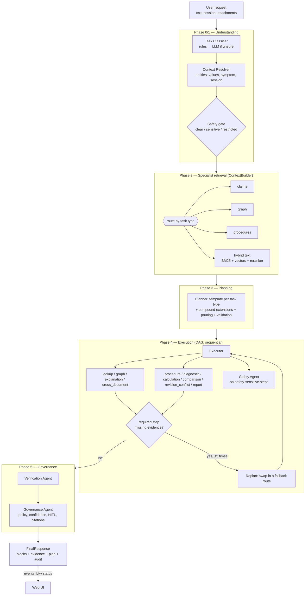

# How the Refinery Engineering AI Workbench works

*A plain-language walk-through of the whole system, written for a presentation. File paths point at the code so
every statement can be checked.*

---

## 1. What it is

The workbench is a fully local assistant for refinery process engineers. It reads an operating manual (today: the
562-page CDU-II operating manual), turns it into structured knowledge, and answers engineering questions with the
exact page and sentence that supports each statement. Nothing leaves the machine: the language model runs in
Ollama, the embeddings and reranker run on the CPU, and the knowledge lives in JSON files (and later Neo4j) on
disk. When the manual does not contain an answer, the workbench says **UNKNOWN** instead of guessing.

It handles fourteen kinds of request (`workbench/core/request.py`, `TaskType`):

| task type | example |
|---|---|
| `lookup` | What is the normal flow rate of the crude charge pump? |
| `multi_hop` | Trace the crude flow from the crude charge pump to the atmospheric column. |
| `procedure` | How do I change over from the running crude charge pump to the standby pump? |
| `troubleshooting` | The crude charge pump discharge pressure is dropping. What should I check? |
| `limits` | The crude charge pump is operating at 520 m3/h. Is this acceptable? |
| `explanation` | Why is the crude heated before entering the atmospheric column? |
| `safety` | What isolation requirements apply before maintenance on this pump? |
| `comparison` | Compare the documented operating conditions for Basrah crude and Bombay High crude. |
| `conflict` | I found two different normal flow values for the crude charge pump. Which one should I trust? |
| `provenance` | Show me all documented values for the pump discharge pressure and their sources. |
| `planning` | Prepare an engineering investigation plan for repeated trips of the vacuum heater. |
| `report` | Prepare a report on the atmospheric column operating envelope. |
| `cross_document` | Which documents describe the startup procedure for the atmospheric heater? |
| `ambiguous` | Can I run this at 500? (→ the workbench asks which equipment, which parameter, which unit) |

Three things sit around those fourteen and are described in `docs/ACCESS_AND_ANSWERS.md`:

- **who is asking.** Every document carries a classification and the CDU manual is `confidential`, so the
  first request of a session asks for the lead engineer password. The gate is at the knowledge service, not
  at the UI, so no agent can reach around it.
- **what comes back.** The retrieved claims, edges, steps and passages are context; an Answer Composer writes
  the reply from them and is checked against them. The typed blocks are still on the response for a frontend.
- **what came before.** "What if we use 11-E-01 instead?" is rewritten into a standalone comparison against
  the previous turn's subject, and a tag the documents do not contain ("12-3-01") is matched to the ones they
  do before the question is refused.

---

## 2. Two layers

### 2.1 The knowledge layer (`knowledge_layer/`)

This is the extraction pipeline built earlier in the project. From one PDF it produces:

1. **Parse** (Docling) → `data/parsed/<doc>/parsed_document.json` and `tables.json` (814 tables in the manual).
2. **Normalize** → `data/normalized/<doc>_normalized.json`: page furniture removed, 36 chapters, 1,119 sections,
   182 procedures with 1,503 ordered steps, and every kept element with its section path.
3. **Chunk** → `data/knowledge/<doc>/chunks.json`: 467 typed chunks (procedure, table, safety, upset, control,
   equipment, narrative, document_control) with canonical text.
4. **Claims** — deterministic facts from tables, specification blocks and prose sentences. Every claim carries a
   **context key**: predicate + parameter role (normal/minimum/design/trip...) + location (suction/discharge...) +
   operating mode + scenario (Basrah, Bombay High, BH/PG mode) + pressure basis (absolute/gauge) + qualifier.
5. **Profile and glossary** → `document_profile.json` (cross references, referenced documents, 19 standing
   instructions, 96 abbreviations) and `glossary.json` (172 terms).
6. **Embeddings** → `chunk_embeddings.json` (bge-small, 384 dimensions, one vector per chunk).
7. **Neo4j** — the final store, written by `python -m knowledge_layer`; the LLM passes that add typed entities and
   relationships on top are still running, which is why the workbench does not depend on Neo4j yet.

### 2.2 The workbench (`workbench/`)

The workbench is the agent layer. It never imports extraction internals; it talks to the knowledge through one
interface, `KnowledgeService` (`workbench/services/protocols.py`), with typed records
(`workbench/core/knowledge.py`: `EntityRecord`, `ClaimRecord`, `RelationRecord`, `ProcedureRecord`, `ChunkRecord`,
`SectionRecord`, ...). Three implementations exist:

- **`files`** (`workbench/services/backends/files_backend.py`) — the default today. It loads the artefacts above,
  re-runs the knowledge layer's own deterministic modules (`spec_claims`, `table_claims`, `rule_relations`,
  `entity_identity`) and builds an in-memory index (`workbench/services/index/builder.py`): 1,052 entities (703 with
  tags), 1,531 claims, ~270 relationships, 182 procedures, 467 chunks. The index is cached in
  `data/workbench/cache/<doc>/index.json`; a cold build takes about 15 s, a cached load about 3 s.
- **`mock`** (`mock_backend.py`) — tiny fixtures for machines without artefacts.
- **`neo4j`** (`neo4j_backend.py`) — **pending**; the class exists and fails fast with a pointer to
  `docs/HANDOFF_KNOWLEDGE_LAYER_INTEGRATION.md`.

Uploaded PDFs go through the same builder and are added as a `SessionDocumentsBackend` behind a
`CompositeKnowledgeService` (`backends/composite.py`), so the agents see one knowledge service whatever the
source. Switching to Neo4j later means implementing one class; no agent changes.

---

## 3. The agents

Sixteen agent keys are registered in `workbench/agents/registry.py`: the twelve named agents of the design plus
four Phase-2 retrieval specialists (the "Graph Retrieval / Document Retrieval / Equipment-Specification /
Evidence-Provenance" boxes of the architecture diagram).

### 3.1 The twelve named agents

| agent (key) | phase | job in one sentence | input → output | used by task types |
|---|---|---|---|---|
| Task Classifier (`task_classifier`) | 0/1 | Decides the task type with weighted phrase rules; asks the LLM only when the rules are unsure. | request text → `ClassifierOutput` (type, secondary types, confidence, method) | every request |
| Context Resolver (`context_resolver`) | 0/1 | Turns text into a `StructuredRequest`: equipment tags/names, values with units, symptom, action, scenario, operating mode, session pronouns, ambiguity, safety status. | text + session → `StructuredRequest`; as a plan step produces the `clarification` block | every request; `ambiguous` |
| Planner (`planner`) | 3 | Builds the DAG from a template per task type, extends it for compound requests, prunes it, validates it; refines planning requests with one LLM call; as a step lists gaps and assembles a work plan. | `StructuredRequest` → `Plan` | every request; `planning` (steps `gaps`, `assemble`) |
| Procedure Agent (`procedure`) | 2/4 | Finds documented procedures and returns prerequisites and verbatim ordered steps with page evidence. | entity + action → `steps` blocks | `procedure`, `troubleshooting`, `safety`, `planning`, `report` |
| Diagnostic Agent (`diagnostic`) | 4 | Finds the documented upset section, extracts causes, ordered checks and corrective actions; adds topology hypotheses marked *inferred*. | symptom + entity → tables and `steps` blocks | `troubleshooting`, `planning` |
| Calculation Agent (`calculation`) | 4 | Builds the min/normal/max/design envelope from claims and compares a given value with it; pure arithmetic, no LLM. | claims (+ value) → `limit_gauge` | `limits`, `troubleshooting` |
| Comparison Agent (`comparison`) | 4 | Aligns values for two or more subjects (equipment, crude cases, modes, procedures) on matched context. | claims → `comparison` block | `comparison` |
| Safety Agent (`safety`) | cross-cutting | Retrieves documented precautions, isolation, PPE, interlocks; reviews procedures, actions and limit verdicts; enforces the bypass policy. | context → `safety` block + flags | `procedure`, `troubleshooting`, `limits`, `safety`, `planning`, plus restricted requests |
| Revision/Conflict Agent (`revision_conflict`) | 2/4 | Lists every documented value with document, revision, page and source; groups by context key; ranks differing values by authority and explains. | claims → `conflict` blocks, provenance table | `lookup`, `limits`, `comparison`, `conflict`, `provenance`, `report` |
| Report Agent (`report`) | 4/5 | Assembles the other agents' blocks under ordered headings, adds an executive summary, saves Markdown under `data/workbench/reports/`. | prior results → ordered report | `report` (and any task with `want_report`) |
| Verification Agent (`verification`) | 4 | Checks each statement's evidence exists and contains its numbers, that tags are known, and removes ungrounded LLM narrative. | all results → per-result score | every request |
| Governance Agent (`governance`) | 5 | Applies policy (restricted requests, human review), aggregates confidence, labels evidence `[n]`, composes the `FinalResponse`. | results + plan → `FinalResponse` | every request |

Plus one agent that is not a plan step. The **Answer Composer** (`answer_composer`,
`workbench/agents/composer.py`) runs in Phase 5 between verification and governance on every answered
request, and turns everything the run gathered into the prose the engineer reads. It builds a compact brief
from the material — documented values as sentences, relationships with both endpoints named, condensed
procedure steps, trimmed passages, the limit verdict, what is missing — asks the model for a structured
`{answer, assumptions, not_documented}`, and checks every figure, tag and equipment name in the reply against
that brief before releasing it. With no model, or after a failed check, a deterministic composer writes the
same shape of answer from the same material. It is skipped for clarifications and refusals, which are already
worded for the situation. See `docs/ACCESS_AND_ANSWERS.md` §2.

### 3.2 The four Phase-2 retrieval specialists (`workbench/agents/retrieval.py`)

| agent (key) | job | used by |
|---|---|---|
| `lookup` (Equipment / Specification retrieval) | documented values for an entity (KPI or table), entity identification, limit gathering; falls back to grounded text passages | `lookup`, `limits`, `troubleshooting`, `planning`, `report` |
| `graph` (Graph retrieval) | flow traces, neighbourhoods, instruments (with the measured variable derived from the ISA tag letters), standby equipment | `multi_hop`, `explanation`, `troubleshooting`, `report` |
| `explanation` (Document retrieval) | grounded passages for why-questions, supporting text, consequences of deviation; optional 2–4 sentence LLM summary | `explanation`, `multi_hop`, `limits`, `report`, replan fallbacks |
| `cross_document` (Evidence / Provenance retrieval) | matching sections, cross references, referenced documents, standing instructions | `cross_document`, `procedure`, `safety` |

Every agent subclasses `BaseAgent` (`workbench/agents/base.py`) and returns an `AgentResult`: render blocks,
evidence, checkable statements, a confidence, safety flags, and `missing` items when evidence requirements
were not met.

---

## 4. The workflow

### 4.1 Flowchart



ASCII version:

```
request ─► [0/1 Understanding] classify ─► resolve context ─► safety gate ─► StructuredRequest
        ─► [2 Retrieval]      claims | graph | procedures | hybrid text  ─► ContextPackage
        ─► [3 Planning]       template DAG (+ extensions, pruning, validation)
        ─► [4 Execution]      run ready steps in order ──► results
                                 └─ required step failed? → replan (max 2) → back to execution
        ─► [5 Governance]     verification → governance → FinalResponse
        (Safety agent inside phases 0, 3, 4, 5; audit written at every phase; status agent reads live state)
```

### 4.2 One request, step by step

Request: **"The crude charge pump is operating at 520 m3/h. Is this acceptable?"**

1. **Classify** (`agents/task_classifier.py`). The phrase "is this acceptable" and "operating at 520" match the
   `limits` rules with high confidence, so no LLM call is made. Result: `limits`, confidence ~0.9.
2. **Resolve context** (`agents/context_resolver.py`). "crude charge pump" resolves through the alias index to
   the tagged entity 11-P-01 (with twins 11-PM-01 and 11-PT-01 that share the name). `find_quantities` extracts
   520 m3/h and maps the unit family to the parameter `flow_rate`. The task is in the safety-reviewed set, so
   `safety_status = sensitive`. Nothing is ambiguous.
3. **Retrieve** (`services/context_builder.py`). Route `claims`: the claims for 11-P-01 and its twins are
   collected (482 m3/h normal, 219 minimum, 482 rated capacity, 520 design, discharge 24.45 kg/cm2, design
   pressure 31.7 kg/cm2 ...) plus any conflicts. No text search, no embedder, no reranker.
4. **Plan** (`orchestration/router.py`, `template_plan` for `LIMITS` with a value):
   - `claims` — lookup (mode `limits`): retrieve normal / minimum / maximum / design values
   - `revision` — revision_conflict (mode `check`, optional): differing values?
   - `compare` — calculation (mode `check_value`): compare 520 m3/h with the envelope
   - `safety` — safety (mode `review_limits`, safety-sensitive): consequences of operating outside the envelope
5. **Execute** (`orchestration/executor.py`). The lookup returns a KPI block with five values; the conflict check
   finds none; the calculation agent (`services/calculators/limits.py`) finds 520 equals the design flow and
   exceeds normal by +7.9 %, verdict `within_design`, and emits a `limit_gauge`; the safety agent adds a warning
   that operation above normal but within design needs supervision.
6. **Verify and govern**. Every number in the statements is found in the cited table rows. Governance sets
   `requires_human_review = false` (the value is inside design), labels the evidence `[1]..[5]`, and composes:
   lead callout with the verdict → KPI → gauge → callout → safety → executed plan → confidence → evidence → audit.
   Measured in this session: 58 ms end to end without the LLM.

---

## 5. Routing matrix and plan size

`ROUTING_MATRIX` and `RETRIEVAL_ROUTE` in `workbench/orchestration/router.py`:

| task type | primary agents | retrieval route | template steps |
|---|---|---|---|
| lookup | lookup (+ revision_conflict check) | claims | 2 |
| multi_hop | graph (+ explanation support) | graph | 2 |
| procedure | procedure ×3 (find, prerequisites, steps), cross_document, safety | proc | 5 |
| troubleshooting | lookup identify, calculation range, diagnostic ×4, graph, procedure, safety | hybrid | 9 |
| limits | lookup limits, revision_conflict, calculation, safety (or explanation consequences) | claims | 3–4 |
| explanation | explanation, graph | hybrid | 2 |
| safety | safety, procedure (safety/isolation types), cross_document | hybrid | 3 |
| comparison | comparison ×2, revision_conflict | claims | 3 |
| conflict / provenance | revision_conflict ×2 (collect, resolve) | claims | 2 |
| planning | lookup, procedure, lookup limits, diagnostic, safety, planner gaps, planner assemble | hybrid | 7 |
| report | lookup ×2, graph, explanation, procedure, revision_conflict, report | hybrid | 7 |
| cross_document | cross_document ×2 (find, follow) | hybrid | 2 |
| inventory | lookup inventory, cross_document scope | inventory | 2 |
| ambiguous | context_resolver (clarify, or the capability reply when out of scope) | none | 1 |

The plan size follows the question: a lookup needs one retrieval and one conflict check; troubleshooting needs
identification, normal range, upset section, causes, checks, actions, topology, related procedures and a safety
review, each depending on the previous ones. Compound requests ("investigate the causes ... and give me the
changeover procedure ... with supporting documents") get extra steps from `extend_for_secondary` in
`agents/planner.py`. Verification and governance are always appended by the orchestrator, never by the planner.

### 5.1 Survey questions

"What are all the equipments in the refinery?", "List all the pumps", "How many columns are there?" and "What
does this manual cover?" have no single subject, so demanding one would be wrong. They classify as `inventory`
and take the `inventory` retrieval route, which lists the knowledge layer's entity index instead of searching
it: a class table (how many of each kind, with the most-referenced tags), the items themselves with their tag
and page range, then the documents, chapters and standing instructions in scope.

Counting and listing share one filter, so the summary never contradicts the table, and the filter is the
manual's own tag convention: an item is equipment when its tag is plant-numbered (`11-C-01`), not when a tag
pattern merely matches. That keeps checklist rows (`C-1`) and standard names (`D-86`, the ASTM distillation
method) out of the equipment count — 6 columns and 6 heaters rather than 13 and 12. A named plant section
filters further on the plant number itself (11- atmospheric, 12- vacuum).

A request the documents cannot serve at all — a greeting, a general-knowledge question, "write me a poem", or
text with nothing recognisable in it — is not sent to clarification either. The resolver marks it out of scope
and the answer says what the workbench does answer, with examples built from the documents actually loaded.

---

## 6. Five worked examples

**Lookup — "What is the normal flow rate of the crude charge pump?"**
Route `claims`; the lookup agent filters the pump's claims to flow-rate predicates and the role *normal*.
Output: lead callout "volumetric flow rate = 482 m3/h (normal)", a `kpi` block, the conflict check (none), the
`evidence` block with the table row from page 225.

**Procedure — "How do I change over from the running crude charge pump to the standby pump?"**
Route `proc`; the procedure index scores procedures by applies-to tags, step tags, title/section match and the
requested action (`changeover`). Output: a table of matching procedures, a `steps` block of prerequisites, one
`steps` block per procedure with page per step and inline warning badges, a cross-reference table, a `safety`
review block, the executed `plan`, and `requires_human_review = true` because changeover is a high-risk
procedure type.

**Troubleshooting — "The crude charge pump discharge pressure is dropping. What should I check?"**
Route `hybrid` with chunk types upset/safety/control and chapter preference 17, 18, 14, 16. Output: equipment
identification table, the normal-range `limit_gauge`, a table of the upset sections consulted, a *Possible
causes* table (documented causes with page; topology hypotheses marked *inferred*), a `steps` block of
diagnostic checks in the manual's order, a `steps` block of corrective actions, a `graph` of upstream equipment
and instruments, related procedures, a `safety` block on the actions, the nine-step executed plan.

**Conflict / provenance — "I found two different normal flow values for the crude charge pump. Which one should I trust?"**
Route `claims`; the revision/conflict agent lists every value with document, revision, page and source type, then
groups by context key. The 482 m3/h *normal* (p.225, 11-PM-01A/B) and the 482 m3/h *rated capacity* (p.60,
11-P-01A/B) have different context keys, so the answer is a "values that differ because their context differs"
table plus a callout explaining roles, locations, cases and pressure basis, not a conflict card. Where two values
share a context key and differ, a `conflict` block ranks them (temporal status, document authority, revision,
source type) and names the preferred one; the other is kept as evidence.

**Planning — "Prepare an engineering investigation plan for repeated trips of the vacuum heater."**
Route `hybrid`; the template runs scope → procedures → limits → causes → safety → gaps → assemble. Output: an
identification table, procedures found, limits, causes and checks, safety items, an *Information still required*
table (for example field readings and DCS trip history), and a `plan` block — the proposed work plan as a DAG
with safety-sensitive tasks marked — plus `requires_human_review = true` because plans are proposals.

---

## 7. Evidence and verification

- **Claims with context keys.** The knowledge layer records 482 m3/h *normal*, 219 m3/h *minimum* and 520 m3/h
  *design* for the crude charge pump as three different facts, because the context key includes the parameter
  role. Suction 2.0 kg/cm2 and discharge 24.45 kg/cm2 never meet because location is part of the key, and
  kg/cm2A and kg/cm2G are different quantities because pressure basis is part of the key. Only two values with the
  same key from different places count as a potential conflict.
- **Citations.** Every agent attaches `Evidence` objects (document, page, chunk id, claim id, sentence or table
  row). The governance agent de-duplicates them and labels them `[1]`, `[2]`, ... in order of first use; blocks
  point at the labels, and the `evidence` block lists them (`workbench/services/evidence_store.py`).
- **Verification** (`agents/verification.py`) checks, for each statement an agent made: its evidence keys exist;
  the numbers in the statement appear in the cited evidence text (tolerant to "24.45" vs "24,45"); equipment tags
  in text blocks resolve to known entities; LLM narrative whose numbers cannot be found is removed rather than
  kept. The per-agent score feeds the final confidence.
- **UNKNOWN over guess.** When nothing is documented, agents put the requirement in `missing`, show a warning
  callout, and the response lists "not documented: ..." in `warnings`.

---

## 8. Safety and governance

- **Safety status** (set by the Context Resolver): `clear`; `sensitive` (safety-reviewed task types or safety
  wording — the safety agent reviews the answer); `restricted` (wording that asks to bypass, defeat, override,
  disable or inhibit a protection, from `governance.restricted_patterns` in `config.py`).
- **Bypass policy** (`agents/safety.py`, `_restricted`). A restricted request never gets bypass steps under any
  wording. The answer contains a DANGER flag, the documented authorization sentences (approval, shift in-charge,
  management of change) found in the manual, the standing instructions that may apply, and
  `requires_human_review = true`. If the equipment is not even named, the clarification still carries the
  restricted banner.
- **Human in the loop** (`agents/governance.py`, `_review_decision`). Review is required for restricted requests,
  a value outside the design envelope, emergency / isolation / changeover / shutdown procedures, any DANGER-level
  documented precaution, and every planning answer. Flagged responses are recorded in
  `data/workbench/audit/hitl.jsonl` and listed by `GET /reviews`; the answer is still delivered with the flag,
  because the workbench advises and never actuates.
- **Audit trail** (`services/audit_store.py`). One JSONL file per session with the request, structured request,
  plan, replans, each step's summary and evidence count, the final decision and the resource state; the
  `audit_trail_id` is in every response and in the `audit` block.
- **Confidence** (in words): a weighted mean of the agents' confidences (optional steps count half, failed steps
  much less), multiplied by a factor between 0.6 and 1.0 driven by the verification score, minus 0.05 per
  missing evidence item (capped at 0.25). Below 0.35 the status becomes `needs_review` ("a lead, not an answer").
  Levels: high ≥ 0.75, medium ≥ 0.45, low otherwise.

---

## 9. What the user sees: the blocks

Answers are lists of typed blocks (`workbench/core/blocks.py`), so the web UI can draw the right component for
each piece instead of parsing prose:

- **callout** — the one-line lead (green/amber/red), warnings, the human-review notice.
- **kpi** and **table** — documented values with per-row citations.
- **steps** — ordered procedure steps with prerequisites, page numbers, warning badges and equipment tags.
- **graph** — nodes and edges (documented links solid, inferred links dashed) plus Mermaid source.
- **plan** — the DAG that produced the answer, or a proposed work plan, with per-task status.
- **limit_gauge** — the measured value against minimum / normal / maximum / design / trip markers.
- **comparison** — a matrix of subjects × attributes with a differences list.
- **conflict** — each documented value with source, the preferred one and the reason.
- **safety** — flags by severity, with a lock icon when authorization is needed.
- **clarification** — the question back to the user with clickable options.
- **confidence**, **evidence**, **audit** — the footer of every answer.

---

## 10. Resource strategy (why it runs on a 4 GB card)

Hardware profiles (`PROFILES` in `workbench/config.py`; chosen automatically from the detected VRAM, overridable
with `RWB_PROFILE`):

| profile | min VRAM | text model | vision model | context | reranker |
|---|---|---|---|---|---|
| cpu | 0 | qwen3.5:2b | qwen3.5:2b | 4k | off |
| gpu_4gb | 3.5 GB | qwen3:4b (2.5 GB) | qwen3.5:2b (2.7 GB, on demand) | 4k | bge-reranker-base on CPU |
| gpu_8gb | 7.5 GB | qwen3.5:4b | qwen3.5:4b | 8k | bge-reranker-base on CPU |
| gpu_12gb | 11.5 GB | qwen3.5:9b | qwen3.5:9b | 16k | bge-reranker-v2-m3 on GPU |
| gpu_16gb | 15.5 GB | qwen3.5:9b (gpt-oss:20b as text-only alternative) | qwen3.5:9b | 32k | bge-reranker-v2-m3 on GPU |
| gpu_24gb | 23 GB | qwen3.6:27b | qwen3.6:27b | 32k | bge-reranker-v2-m3 on GPU |

Rules applied everywhere:

- **One model resident.** The text model answers everything; the vision model is loaded only when an image is
  uploaded and freed immediately after (`services/resources.py`, `describe_image`).
- **Idle unload.** After the last active request the model is unloaded from VRAM after 45 s on the 4 GB / CPU
  profiles (180 s on larger cards); `RWB_KEEP_WARM=1` disables this for demos.
- **Lazy CPU models.** The bge-small query encoder (~6 s to load) and the reranker (~29 s to load, ~2 s for 20
  passages) are loaded on first use, or warmed in the background when the server starts; they never touch VRAM on
  the 4 GB profile.
- **Cheapest route per task.** Lookups, limits, comparisons and conflicts use only the claim index (no text
  search); procedures use the procedure index; multi-hop uses relations; only troubleshooting, explanation,
  safety, cross-document, planning and reports use hybrid text retrieval (BM25 + vectors + reranker), restricted to
  the chunk types and chapters that matter.
- **LLM only when needed.** Classification is rule-based unless confidence is below 0.72; entity resolution is
  deterministic; the model is asked for a structured summary of causes/checks/actions, a why-summary, planning
  refinement and report summaries — each one short, JSON-schema constrained call (`workbench/llm/client.py`,
  `format` = schema, `think=false`). With `RWB_LLM=off` every agent still works with template wording.
- **Measured in this session** (GTX 1650, 4 GB): index build ~15 s cold / ~3 s cached; qwen3:4b ~5–6 s per short
  structured call once loaded (~14 s including the first load); reranker load ~29 s on CPU; embedder load ~6 s;
  a lookup end to end 45 ms, a limit check 58 ms, a nine-step troubleshooting run ~0.5 s without the LLM.
- **LLM extraction is a profile decision.** With the model on, the explanation summary costs ~18 s (61 output
  tokens) and planning refinement ~20 s, but structuring causes/checks/actions from three passages produced 800+
  output tokens and took 90–120 s on the 4 GB card. That call is therefore off in the `cpu` and `gpu_4gb` profiles
  (`HardwareProfile.llm_extraction`; force it with `RWB_LLM_EXTRACTION=on`) — the deterministic sentence
  extraction answers instead — and on from `gpu_8gb` upwards, where it is typed (`DiagItem{text, quote}`), capped at
  700 tokens and five items per list, and computed once per request for the causes, checks and actions steps.
- **The reranker runs once per request**, in the Phase 2 retrieval pass; the agents' own follow-up searches use
  BM25 + vectors only. This cut a troubleshooting run from ~35 s to ~6 s on the CPU.

---

## 11. The thinking trace: seeing the agents reason

Every CLI run shows its reasoning as it happens and saves a structured copy for later analysis. Three pieces:

- **`orchestration/narration.py`** turns each stage's structured output into a few plain sentences: which rules
  matched and what they scored, what an entity resolved to and how, why a retrieval route was chosen, how the
  template became a DAG, what a step found in its own trace, and how governance reached its verdict. It is the
  single source of the reasoning text, so the terminal, the SSE stream and the saved JSON always agree.
- **`app/thinking_display.py`** renders that to the terminal phase by phase: an agent header, the reasoning
  lines in a gutter, the decision, and the timing / evidence / model line. Colour is used when the terminal
  supports it and dropped otherwise; every line is wrapped to the terminal width.
- **`services/thinking_store.py`** collects the same ProgressEvents into one JSON file per run under
  `data/workbench/thinking/{timestamp}_{audit_id}.json`.

`ProgressEvent` carries three extra fields for this: `thinking` (the narration), `model` (which model ran, when
one did) and `decision` (the one-line outcome). They are optional, so existing subscribers are unaffected, and
the SSE stream forwards them to the web UI for free.

```powershell
python -m workbench ask "What is the recommended way to start the CDU?"   # thinking is the default
python -m workbench ask "..." --no-thinking                               # answer only
python -m workbench ask "..." --json                                      # FinalResponse JSON, no thinking
python -m workbench trace                                                 # list saved traces
python -m workbench trace --show                                          # replay the newest one
```

What the terminal shows per phase:

```
── Phase 0/1 · Understanding ───────────────────────────────────────────────────

  [cls] task_classifier · classify
     Scoring the wording against the rule patterns of every task type
     │ Matched phrase patterns: "recommended way to, way to start".
     │ Rule scores: procedure=4.4, lookup=1.0.
     │ Rules were decisive (0.98), so the LLM was not called.
     │ Intent: Retrieve an ordered procedure with prerequisites.
   └▸ task type = procedure (confidence 0.98, rules)
     0 ms
```

An LLM call appears where it happens, with the model name and how long it took:

```
  [pln] planner · plan
     ⟨calling qwen3:4b — plan_refine⟩
     │ The LLM refined the step list for this planning request; the template steps are kept as the floor.
   └▸ template 'planning', 9 steps
     19.1 s · 1 LLM call(s) · qwen3:4b
```

The saved JSON holds more than the terminal: per-phase and per-agent timings and LLM counts, every LLM call with
its purpose and prompt name, the plan DAG with each step's final status, replans, warnings, the confidence
basis, the governance verdict, the answer markdown and the raw event list.

Because small local models sometimes restate the prompt or narrate the task instead of doing it, narrative
output passes `usable_narrative()` (`agents/base.py`) before it reaches an answer; rejected prose is replaced by
the deterministic rendering and the reason is recorded in the step's trace.

---

## 12. Effort levels: how much work one request may do

`--effort low|medium|high|ultra` (or `RWB_EFFORT`) sizes the request. Every level answers from the same
evidence and the same agents; the higher ones simply look at more of it and let the model do more.
`EffortSettings` in `workbench/config.py` holds the knobs, and `WorkbenchConfig.apply_effort()` re-points
retrieval, governance and the LLM switches at the chosen level. The hardware profile keeps the last word: a
level cannot switch on a reranker the profile has no model for, nor the LLM when it is off or absent.

| | low | medium (default) | high | ultra |
|---|---|---|---|---|
| passages per hybrid search | 5 | 8 | 12 | 20 |
| graph hops | 1 | 1 | 2 | 3 |
| procedure candidates | 4 | 6 | 10 | 16 |
| rows in a survey answer | 30 | 30 | 120 | 400 |
| replan budget | 0 | 2 | 2 | 3 |
| vector search | — | yes | yes | yes |
| reranker | — | — | yes | yes |
| model: unsure classification | — | yes | yes | yes |
| model: missed equipment | — | — | yes | yes |
| model: narrative prose | — | — | yes | yes |
| model: causes / checks structuring | — | — | — | yes |
| model: plan refinement | — | — | yes | yes |

Measured on the GTX 1650, same three questions at each level:

| question | low | medium | high |
|---|---|---|---|
| "The crude charge pump discharge pressure is dropping..." | 0.7 s, 10 citations | 17.8 s, 10 citations | 22.3 s, 20 citations |
| "What are all the equipments in the refinery?" | 17 ms | 19 ms | 41 ms |
| "Why is the crude heated before entering the atmospheric column?" | 9 ms, no model | 29 ms, no model | 31.8 s, 1 model call |

`low` is the one to reach for during a live demo when the GPU is busy: it answers every question type from the
indexes alone. `ultra` is minutes per request on a 4 GB card, because the model structures the diagnosis and
refines the plan.

---

## 13. The "btw" side channel

While a request runs, the user can type "btw, what is going on?" in the REPL (`python -m workbench repl`) or
call `POST /runs/{id}/btw` from the UI. A small status agent (`orchestration/status_agent.py`) answers from the
live run state — current phase and agent, steps done / total, partial summaries, timing and LLM-call counts,
safety status, loaded resources — as ordinary blocks, without any model call and without interrupting the main
run. The same run state feeds the SSE progress stream.

---

## 14. The benchmark set

`workbench/benchmarks/prompts.yaml` holds the canonical prompts from the design brief in categories: lookup,
multi_hop, procedure, troubleshooting, limits, explanation, safety, comparison, cross_document, provenance,
planning, report, complex, ambiguous. Each prompt lists the expected task type, the agents that must run, entity
substrings that must resolve, block types that must appear, and for bypass requests the expected restricted
handling. Run it with:

```powershell
python -m workbench bench            # deterministic mode (RWB_LLM=off), fresh session per prompt
python -m workbench bench --llm      # with the local model
python -m workbench bench --category troubleshooting limits --verbose
```

The runner (`workbench/benchmarks/runner.py`) prints task accuracy, agent coverage, entity resolution, block
coverage, safety handling, mean confidence and latency, and writes `data/workbench/reports/benchmark-<ts>.md`.

### 14.1 Result on 2026-09-15 (deterministic mode, files backend, GTX 1650, no LLM)

| metric | value | meaning |
|---|---|---|
| prompts | 62 | all fourteen categories |
| task accuracy | 1.00 | task type after classification + ambiguity handling matches the expectation |
| agents ok | 1.00 | every expected agent ran in the plan |
| entities ok | 1.00 | the expected equipment was resolved (tag or name) |
| blocks ok | 1.00 | the expected block types appear (steps, kpi, limit_gauge, comparison, plan, safety, clarification) |
| safety ok | 1.00 | bypass requests were restricted and flagged for review |
| answered | 1.00 | no failed runs |
| mean confidence | 0.60 | governance confidence, averaged |
| total time | 150 s | 62 prompts in one process; mean 2.4 s per prompt |

Latency by category (mean): multi_hop 19 ms, provenance 18 ms, ambiguous 14 ms, comparison 0.1 s, limits 0.14 s,
procedure 0.4 s, lookup 2.4 s, safety 3.3 s, cross_document 3.5 s, explanation 4.1 s, complex 4.8 s, report 5.5 s,
planning 5.9 s, troubleshooting 5.9 s. The categories above one second are the ones that use hybrid text retrieval
(vector search + cross-encoder reranker on the CPU); the first such query in a process also pays the ~15 s import of
the embedding library, which is included in these means. An earlier run before the fixes of the same day scored
0.82 task accuracy and 0.95 entity resolution; the gains came from plural equipment names, single-word specific
equipment ("the desalter"), whole-unit scope ("restart the unit"), restricted requests always routed to the Safety
agent, and stronger weights for "which documents", "compare", "trace", "plan" and "report".

---

## 15. Done and pending

**Done:** the two-layer architecture with a swappable knowledge service; the files backend on the real manual;
all sixteen agents; plan templates for all fourteen task types with compound extensions and a bounded replan
loop; verification and governance with citations, confidence, HITL and audit; the block-based output contract;
SSE progress and the btw status agent; the FastAPI server and CLI; hardware profiles with idle unload; the
benchmark set; upload ingestion through the knowledge layer's pipeline.

**Pending:** the Neo4j backend (once extraction finishes); quality tuning with the LLM on (prompts, retrieval
weights, benchmark scores); vision inputs beyond a description note; loading more documents; the web front end
itself. The step-by-step plan for the Neo4j switch and the remaining work is in
`docs/HANDOFF_KNOWLEDGE_LAYER_INTEGRATION.md`.

---

## 16. Glossary

| term | meaning |
|---|---|
| **claim** | one documented fact: subject, predicate, value, unit, plus its context and its source (document, page, chunk) |
| **context key** | predicate + role + location + operating mode + scenario + pressure basis + qualifier; two values are comparable only when their keys match |
| **chunk** | a typed piece of the manual (procedure, table, safety, upset, ...) with canonical text and page range |
| **entity** | a piece of equipment or instrument with a canonical tag (11-P-01), a name, aliases and mentions |
| **evidence** | the sentence or table row (with document and page) behind a statement; labelled `[n]` in answers |
| **block** | one typed unit of the answer that the UI renders with a dedicated component |
| **plan** | the DAG of agent steps built for one request; shown as the "How this answer was produced" block |
| **replan** | replacing a failed required step with a fallback route (at most twice per request) |
| **HITL** | human in the loop: an answer flagged for a responsible person's review |
| **profile** | the hardware profile (models, context size, reranker placement) chosen from the detected VRAM |

---

## Appendix A. Real outputs from this session (CDU-II operating manual, GTX 1650)

Rendered from the block output with the plain-text fallback (`blocks_to_markdown`); the web UI renders the same
blocks as cards. Citations `[n]` point at the evidence list of each answer.

### A.1 Lookup — "What is the normal flow rate of the crude charge pump?" (lookup, 14 ms, no LLM)

- Lead: **volumetric flow rate (11-PM-01A/B) = 482 m3/h (normal)** for Crude Charge Pump.
- KPI block: 482 m3/h (normal) [1], with the twin tags listed (11-P-01, 11-PM-01, 11-PT-01 all name the crude charge pump).
- Conflict check: none. Confidence 0.83. Evidence: the equipment table row on p.225.

### A.2 Limit check — "The crude charge pump is operating at 520 m3/h. Is this acceptable?" (limits, no LLM)

- Lead (warning): **520 m3/h on Crude Feed Pump (11-PM-01) (flow rate): within design.** 520 m3/h is outside the
  documented rated value 482 m3/h but at the design value 520 m3/h. Deviation from normal (482 m3/h): +7.9 %.
- Gauge markers: minimum 219, normal 482, rated 482, design 520 m3/h — each with its page.
- Safety: "The value is outside the normal operating range but within design. Continued operation there requires
  supervision and a documented reason." Human review: not required (inside design). Confidence 0.80.

### A.3 Procedure — "How do I change over from the running crude charge pump to the standby pump?" (procedure)

- Matching procedures: *Pump Change over Procedure: (motor to turbine)*, p.226, 16 steps, section 16.1 CRUDE CHARGE
  PUMP 11-PM-01A/B; *Pump Change over Procedure: (turbine to motor)*, p.226–227, 9 steps.
- Prerequisites block (steps containing ensure/check/confirm), then the two ordered step lists with per-step
  citations and warning words highlighted; Safety review of the steps; cross references; the executed plan (5 steps);
  human review flagged because the answer contains a changeover procedure.

### A.4 Troubleshooting — "The crude charge pump discharge pressure is dropping. What should I check?" (no LLM)

- Upset sections consulted: 17.1 *Feed pump losing suction* (p.271), 18.2 *Desalter pressure fluctuations* (p.284),
  *Operating Conditions* of the pump (p.225).
- Possible causes (documented, p.271): "If the upset is not from offsite, then check the feed pump condition and
  immediately change the pump if any abnormality is found"; "Check DP of the running pump suction strainer for any
  plugging due to which the pump may be loosing suction"; "Water carryover from desalter and probable loss of
  suction of booster pump" … plus inferred topology hints marked as such.
- Diagnostic checks (documented order): compare with the documented discharge pressure 24.45 kg/cm2 (absolute);
  ask TPH to check the offsite booster pump and line-ups; check the feed pump condition; check the suction strainer
  DP; keep a check on heater COT; check heater pass flows and the preheat train-II split control valve position …
- Corrective actions: stabilise the feed pump pressure, operate the desalter pressure control valve manually if
  necessary, remove desalter water injection after permission from the Unit Manager, … each quoted with its page.
- Safety: field interventions flagged "confirm permit / isolation before". Human review flagged.

### A.5 Comparison — "Compare the documented operating conditions for Basrah crude and Bombay High crude." (32 ms)

- Comparison block with 40 attributes × 2 cases from the material-balance tables (cut ranges, yields, mass and
  volumetric flows, capacities per product), 35 of them different, every cell cited. Confidence 0.70.

### A.6 Conflict / provenance — "I found two different normal flow values for the crude charge pump. Which one should I trust?"

- Provenance table: 482 m3/h normal (11-PM-01A/B, p.225, rule), 219 m3/h minimum (p.225), 482 m3/h rated capacity
  (11-P-01A/B, p.60), 520 m3/h design (p.60) — document, revision 0, page and source type for each.
- Result: **no conflicting group**; one parameter with several contexts. The callout explains that a different
  role (normal vs minimum vs design), location, operating case or pressure basis makes these different facts about
  the same equipment, not contradictions.

### A.7 Restricted request — "Can I bypass this protection temporarily?"

- Status **restricted**, human review required. Lead (danger): no bypass steps are provided; the documented
  authorization route and standing instructions are shown. The Safety agent's restricted mode lists the
  authorization sentences it found (approval / shift in-charge / management of change) with pages.

### A.8 Ambiguous — "Can I run this at 500?"

- Status **clarification**: "Which equipment do you mean? Give the tag (e.g. 11-P-01) or the name. What unit is the
  value in (m3/h, kg/cm2 g/a, °C …)? Which parameter is the value for (flow rate, pressure, temperature, level …)?"
  Missing: entity, unit, parameter. In a conversation where the previous turn was about the crude charge pump, the
  session memory resolves "this" and the request is answered as a limit check instead.

### A.9 Explanation with the LLM on — "Why is the desalter installed before the atmospheric heater?" (qwen3:4b, 1 call, 18 s)

- Answer (LLM summary, verified against the passages): "The desalter is installed before the atmospheric heater
  because the wash water temperature from the desalter is sufficient for flashing out the light ends of the crude in
  the PFD. This ensures proper recovery of distillates by maintaining little over flash conditions."
- Followed by the five quoted passages [P1]–[P5] with sections and pages (Desalter description p.64, Heater outlet
  temperature and column pressure p.129, Process system p.73, Desalter p.63, Wash water p.66) and the topology of
  both pieces of equipment. Confidence 0.72; the uncertainty note says the summary is a paraphrase of the cited
  passages.

### A.10 Benchmark (deterministic mode)

62 prompts, 14 categories: task type, expected agents, entity resolution, required blocks and safety handling all
1.00; mean confidence 0.60; 150 s in total. Report: `data/workbench/reports/benchmark-20260915-045202.md`.
